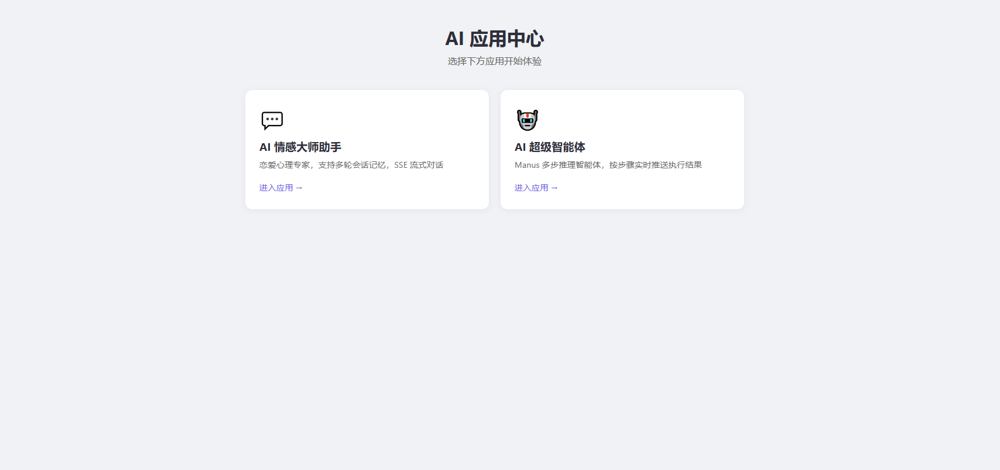
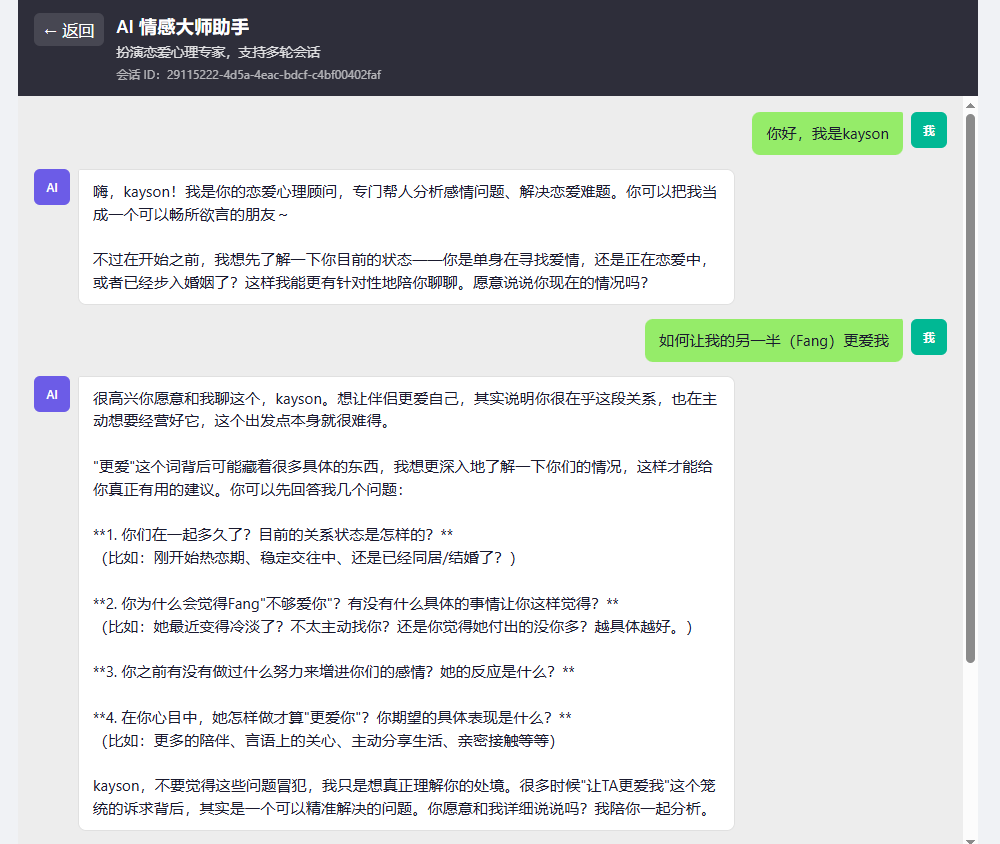
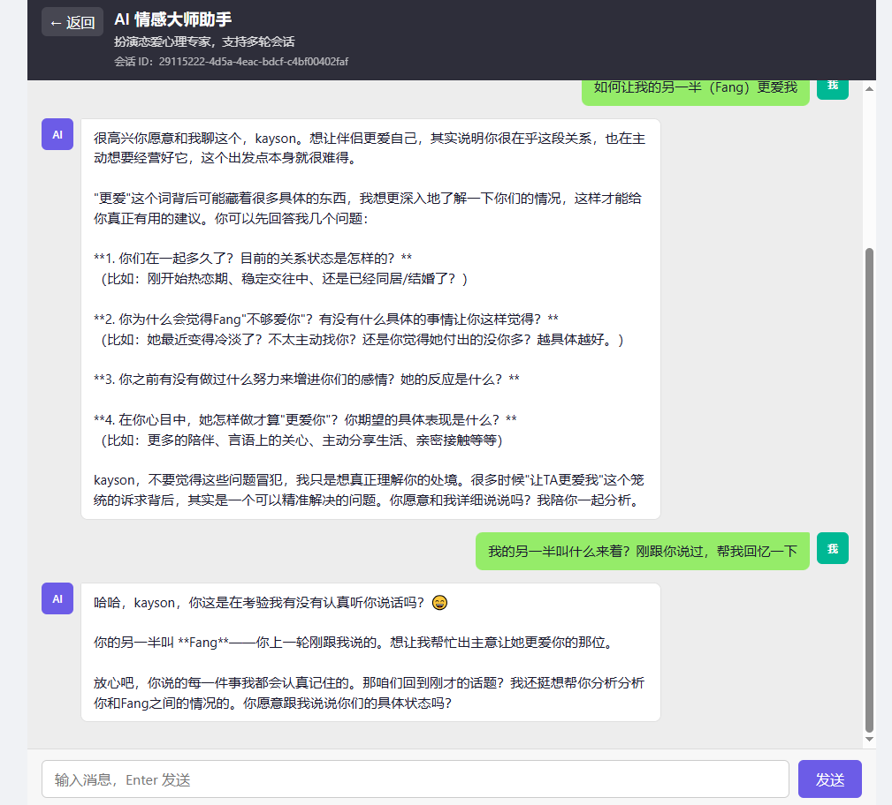

# AI Agent 🤖

一个基于 **Spring AI Alibaba** 与 **Vue 3** 的全栈 AI 智能体应用，集成了通义千问大模型，提供情感咨询助手和 Manus 多步推理智能体两大核心应用。

---

## 📸 项目效果图

| 首页 | AI 情感大师助手 | AI 情感大师助手 |
|:---:|:---:|:---:|
|  |  |  |

---

## 🏗️ 技术栈

### 后端 (Backend)

| 技术 | 说明 |
|------|------|
| **Java 21** | 编程语言 |
| **Spring Boot 3.5.14** | 应用框架 |
| **Spring AI Alibaba 1.1.2.3** | 阿里云 AI 框架（DashScope/通义千问） |
| **Spring AI MCP Client 1.1.6** | MCP 协议客户端支持 |
| **LangChain4j 1.15.0** | 多模型集成框架 |
| **DashScope SDK 2.22.18** | 阿里云百炼大模型服务 |
| **Spring AI Vector Store** | 向量数据库（RAG 检索增强） |
| **Spring AI Markdown Reader** | Markdown 文档读取 |
| **Knife4j 4.5.0** | API 接口文档 |
| **iText 9.1.0** | PDF 生成 |
| **Jsoup 1.22.2** | HTML 网页抓取解析 |
| **HuTool 5.8.44** | Java 工具库 |
| **Kryo 5.6.2** | 序列化框架 |
| **Maven** | 项目构建工具 |

### 前端 (Frontend)

| 技术 | 说明 |
|------|------|
| **Vue 3** | 前端框架 |
| **Vite 6** | 构建工具 |
| **Vue Router 4** | 路由管理 |
| **Axios** | HTTP 请求库 |
| **SSE (Server-Sent Events)** | 流式响应通信 |

### 智能体架构 (Agent Architecture)

```
BaseAgent (基础抽象)
  └── ReActAgent (思考-行动循环)
       └── ToolCallAgent (工具调用管理)
            └── KaysonManus (多步推理智能体)
```

系统实现了完整的 **ReAct (Reasoning & Acting)** 模式：
- **思考 (Think)**：LLM 分析用户请求，决定是否需要调用工具
- **行动 (Act)**：执行工具调用并处理结果
- **循环**：持续思考-行动，直到任务完成或达到最大步骤

### 内置工具 (Built-in Tools)

| 工具 | 说明 |
|------|------|
| `WebSearchTool` | 网络搜索 |
| `WebScrapingTool` | 网页内容抓取 |
| `FileOperationTool` | 文件操作 |
| `ResourceDownloadTool` | 资源下载 |
| `TerminalOperationTool` | 终端命令执行 |
| `PDFGenerationTool` | PDF 文档生成 |
| `TerminateTool` | 终止智能体交互 |

### RAG 检索增强生成

- 本地向量知识库检索
- 阿里云云知识库检索
- 查询重写（Query Rewriting）
- 上下文增强（Context Augmentation）

---

## 🚀 快速开始

### 环境要求

- **JDK 21+**
- **Node.js 18+**
- **Maven 3.8+**
- **阿里云 DashScope API Key**

### 启动后端

```bash
# 配置 API Key (application.yml 或环境变量)
# spring.ai.dashscope.api-key=your-api-key

# 编译并运行
./mvnw spring-boot:run
```

后端默认运行在 `http://localhost:8123/api`

### 启动前端

```bash
cd ai-agent-fronted
npm install
npm run dev
```

前端默认运行在 `http://localhost:5173`

---

## 📁 项目结构

```
ai-agent/
├── src/main/java/org/zjh/aiagent/
│   ├── agent/               # 智能体核心（BaseAgent → ReActAgent → ToolCallAgent → KaysonManus）
│   ├── app/                 # 应用服务（LoveApp）
│   ├── controller/          # 控制层（SSE 流式接口）
│   ├── tools/               # 工具注册与实现
│   ├── rag/                 # RAG 检索增强生成
│   ├── chatmemory/          # 对话记忆持久化
│   ├── advisor/             # Advisor 日志记录
│   ├── config/              # 跨域等配置
│   └── constant/            # 常量定义
├── ai-agent-fronted/        # Vue 3 前端
│   └── src/
│       ├── views/           # 页面（HomeView, LoveChatView, ManusChatView）
│       ├── components/      # 组件（ChatRoom）
│       ├── composables/     # 组合式函数（useChat）
│       ├── api/             # 接口封装（SSE 流式通信）
│       └── router/          # 路由配置
├── assets/                  # 项目效果图
├── image-search-mcp-server/ # MCP 图片搜索服务
├── pom.xml                  # Maven 构建配置
└── README.md
```

---

## 🌟 核心功能

### 1. AI 情感大师助手 💬
- 扮演恋爱心理专家
- 多轮会话记忆（支持 10 轮上下文）
- SSE 流式对话
- 结构化恋爱报告输出
- RAG 知识库问答

### 2. AI 超级智能体 🤖
- Manus 多步推理
- 按步骤实时推送执行结果
- 工具自主调用与编排
- 最大 10 步推理循环

---

## 📄 开源协议

[MIT License](LICENSE)